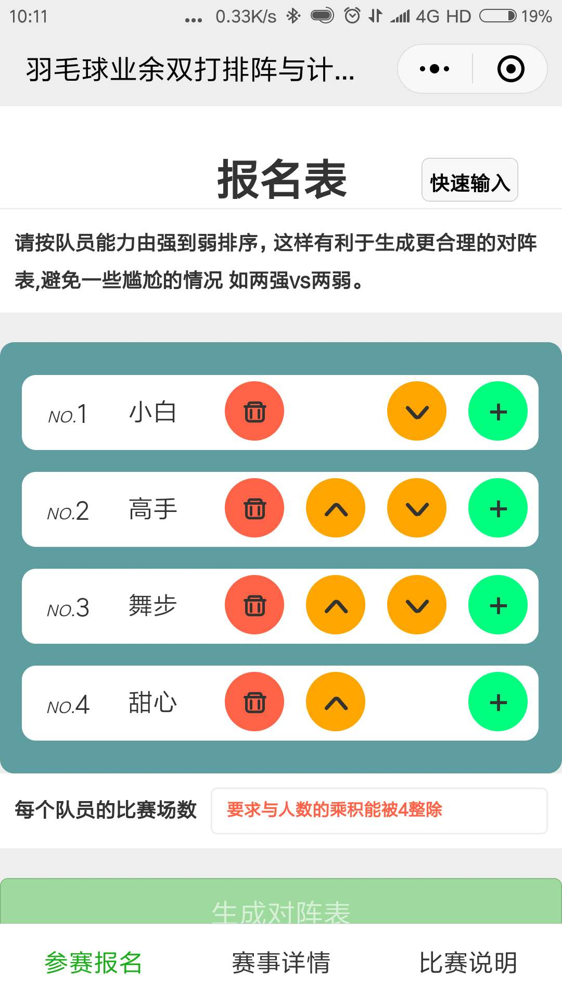
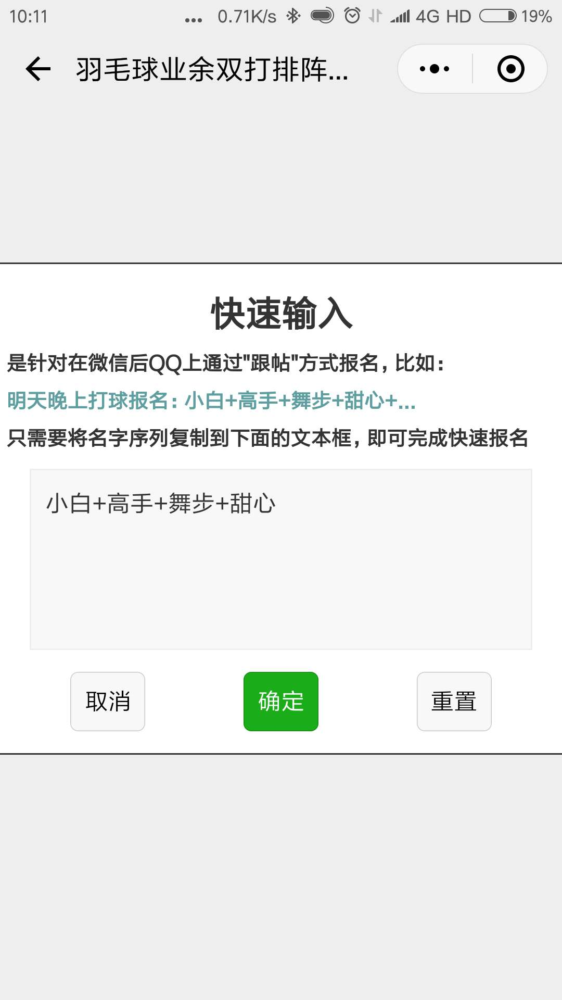
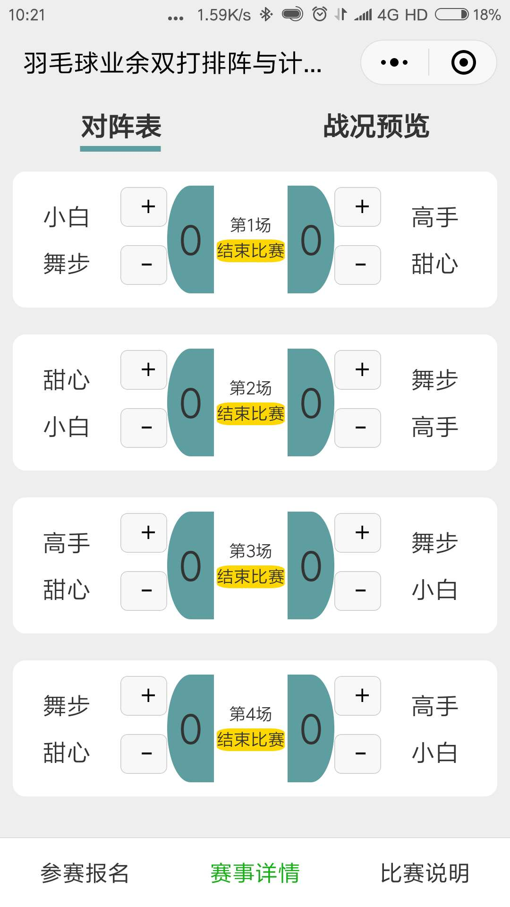
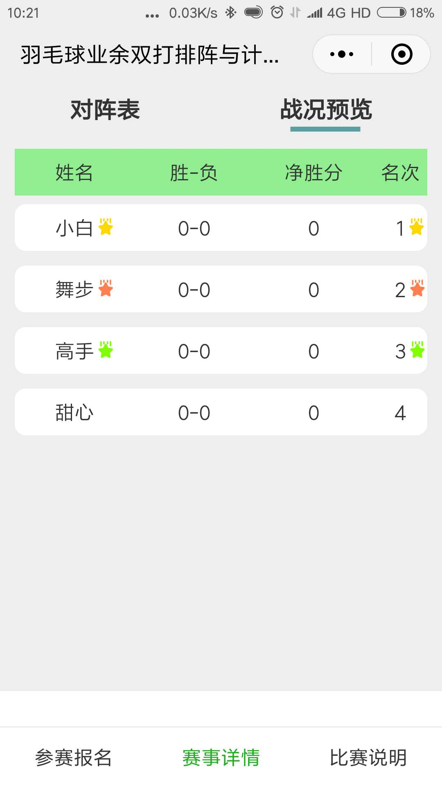

# CGGC羽球赛 
### 一个微信小程序
<text style="color:gray">针对羽毛球爱好者团体,组织比赛后，程序根据人数和场次设定值，帮助生成对阵方案，确保满足每个人都上场相同的次数，并且每个人都尽量多的和其他每个人 作为队友，与其他组队进行比赛，并记录比赛得分 统计最终排名</text>

### 功能介绍
* tabBar1 用于参赛报名  支持排序
* tabBar2 排阵列表及计分 根据实际得分情况，排名次
* tabBar3 赛制说明
### 二维码

 
### 图片

调整实力

报名

对阵方案

排名定位

