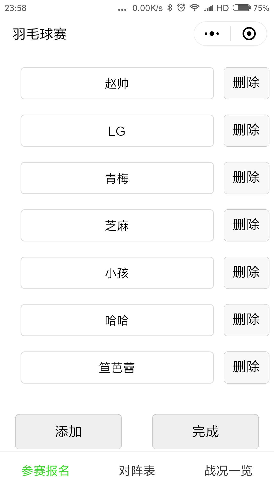
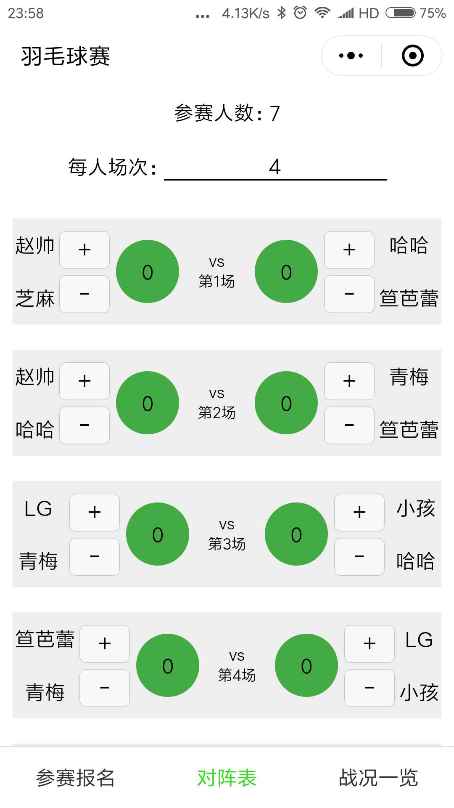
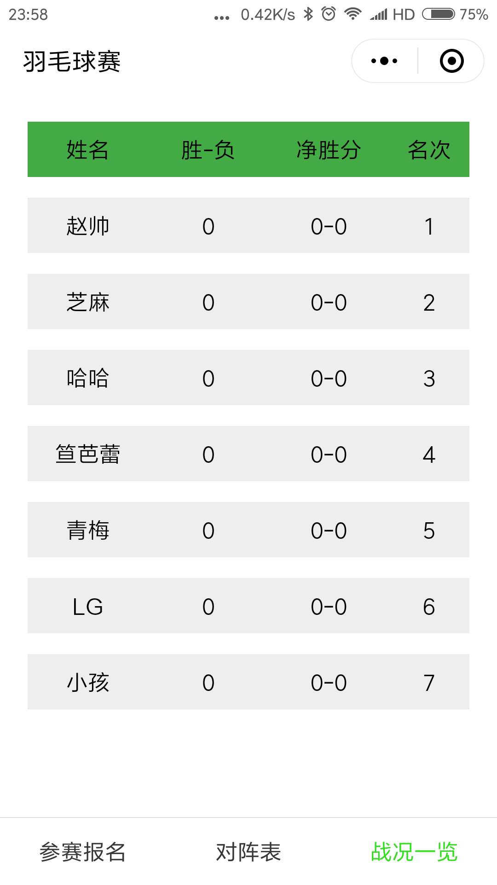

# 羽毛球双打 自动分配对阵表
一个微信小程序
### 功能介绍
* 第一个页面 用于参赛报名
* 第二个页面 排阵列表及计分
* 第三个页面 根据实际得分情况，排名次
### 图片

### 要点
* array 及 object的拷贝
>>> array与object 都是指针类型的数据 需要做深拷贝之后操作
* object对象按照某个字段排序
>>> 利用递归 按照选择字段的排序规则，先把正确顺序的 key值放在 有序数组中，然后按照这个有序数组，将object[key]依次放在 新 object中;
* 布局
>>> 利用flex 和 grid布局，第二个页面用的是 flex布局，第三个页面用的是grid布局，发现grid布局排版更规整 HTML更少级别的嵌套，较flex有更大优势（哈哈哈哈 或许哪天强迫症犯了 就把flex成grid了吧）

